# Loyal Customers vs. Ghost Accounts
## A Machine Learning Framework for Predicting User Retention and Churn on KKbox

**Authors:** [Yingying Yang](https://github.com/your-handle) · [Darryl Jent](https://github.com/darryl-handle) · [Linxin Liu](https://github.com/linxin-handle) · [Kaiwen Jin](https://github.com/kaiwen-handle) · [Albert Lu](https://github.com/albert-handle)

📄 [Executive Summary](KKBox%20Churn%20Prediction%20Executive%20Summary.pdf)

A time-aware validation framework identifies high-risk users with XGBoost achieving strong predictive performance while maintaining model interpretability.


## Table of Contents

1. [Project Summary](#project-summary)
2. [Project Overview](#project-overview)
3. [Data Sources](#data-sources)
4. [Churn Definition](#churn-definition)
5. [Data Pipeline](#data-pipeline)
6. [Data Preparation Summary](#data-preparation-summary)
7. [A Data Leak We Found and Fixed](#a-data-leak-we-found-and-fixed)
8. [Feature Engineering](#feature-engineering)
9. [Modeling Pipeline](#modeling-pipeline)
10. [Models Evaluated](#models-evaluated)
11. [Model Selection: Validation, Not Cross-Validation](#model-selection-validation-not-cross-validation)
12. [Final Model: XGBoost](#final-model-xgboost)
13. [Can an Ensemble Do Better?](#can-an-ensemble-do-better)
14. [Explaining Predictions: SHAP → LLM](#explaining-predictions-shap--llm)
15. [Repository Structure](#repository-structure)
16. [Getting Started](#getting-started)


## Project Summary

| Component | Description |
|-----------|-------------|
| **Dataset** | **Dataset** | ~17M user-cohort observations across 25 monthly cohorts (Feb 2015 – Feb 2017) |
| **Target** | `is_churn` — binary (1 = did not renew within 30 days of expiry, 0 = renewed) |
| **Class balance** | Churn rate falls over time: ~8.0% (train) → 6.5% (val) → 5.5% (test) |
| **Final Model** | XGBoost selected on PR-AUC = **0.542**, achieving **9.8×** improvement over the base rate |


## Project Overview

Music streaming platforms acquire millions of users, yet retaining long-term subscribers remains a major challenge. This project develops a machine learning framework to predict user churn on KKBOX by leveraging subscription patterns, listening behaviors, and user profile information.

The goal is to identify users at risk of leaving before subscription renewal and uncover behavioral patterns associated with churn. The pipeline uses a time-aware evaluation framework to ensure realistic future prediction and reliable model assessment.


## Data Sources

| File / Source | Description |
|---|---|
| **transactions.csv** | User transaction records (~1M rows), including payment history, subscription plans, renewal status, and cancellation behavior. |
| **transactions_v2.csv** | Updated transaction records (~1M rows) containing additional subscription activities through 2017-03-31. |
| **user_logs.csv** | Daily user listening behavior logs (~1M rows), including song play counts, unique songs, and total listening duration. |
| **members_v3.csv** | User demographic and account information (~1M rows), including city, age, gender, registration method, and account dates. |


## Churn Definition

The original KKBOX competition dataset provides churn labels for a subset of users, but does not provide a consistent labeling framework across all monthly cohorts. To support a cohort-based expanding window prediction setting, we constructed churn labels using future renewal behavior.

For each cohort month, users whose membership expired within that month were selected as prediction targets. A user was labeled as:

- `churn = 1`: no renewal transaction occurred within 30 days after membership expiration.
- `churn = 0`: the user renewed successfully within the 30-day post-expiration window.

This cohort-based labeling strategy enables consistent evaluation across time and allows the model to simulate real-world churn prediction using only historical information available before each prediction cutoff.


## Data Pipeline

```mermaid
%%{init: {
  "flowchart": {
    "nodeSpacing": 90,
    "rankSpacing": 80,
    "curve": "basis"
  },
  "themeVariables": {
    "fontSize": "20px"
  }
}}%%

flowchart LR


%% =========================
%% Stage 1: Data Integration
%% =========================

subgraph DATA["Data Integration"]

direction LR


A["transactions.csv<br/>Payment records<br/>Renewal / cancellation"]

B["transactions_v2.csv<br/>Extended transaction history"]

C["members.csv<br/>User profile"]

D["user_logs.csv<br/>Listening activity"]


E["Transaction Integration<br/>Combine transaction history"]

F["Cohort Construction<br/>Identify users expiring<br/>within each cohort month"]

G["Profile Integration<br/>Merge member information"]

H["Activity Integration<br/>Attach historical logs<br/>before cutoff date"]

I["User-Cohort Raw Dataset<br/>Integrated transaction, profile,<br/>and activity records"]



A --> E
B --> E

E --> F

F --> G
C --> G

G --> H
D --> H

H --> I


end



%% =========================
%% Stage 2: Feature Engineering
%% =========================

subgraph FEATURE["Feature Engineering"]

direction TB


J["User-Cohort Aggregation<br/>Group records by user and cohort<br/>Create one row per user-cohort"]

K["Feature Construction<br/>Generate payment, renewal,<br/>cancellation, and engagement features"]

L["Feature Selection<br/>Analyze feature-churn relationships<br/>Select 9 predictors"]

M["Data Preparation<br/>Missing value imputation<br/>Time-based train / validation / test split"]

N["Final Modeling Dataset<br/>25 monthly cohorts<br/>9 selected features"]



J --> K
K --> L
L --> M
M --> N


end



%% =========================
%% Main Flow
%% =========================

I --> J



%% =========================
%% Styling
%% =========================

classDef raw fill:#4F73B8,color:white,stroke:#333,font-size:20px;

classDef process fill:#63A46C,color:white,stroke:#333,font-size:20px;

classDef final fill:#C94C4C,color:white,stroke:#333,font-size:20px;


class A,B,C,D raw;

class E,F,G,H,I,J,K,L,M process;

class N final;



%% Remove left stage box, keep right stage box

style DATA fill:none,stroke:none

style FEATURE fill:none,stroke:#666,stroke-width:2px,stroke-dasharray:6 6

```




## Data Preparation Summary

| Step | Operation |
|---|---|
| 1 | **Transaction integration and cohort construction**: Combined `transactions.csv` and `transactions_v2.csv`, removed duplicate records, and identified users whose memberships expired within each cohort month as prediction targets. |
| 2 | **User profile and activity integration**: Merged `members.csv` and historical `user_logs.csv` information with target users using `msno`, while restricting activity records to the period before each cohort cutoff date. |
| 3 | **User-cohort dataset construction**: Integrated transaction, profile, and activity records into a user-cohort level dataset, where each observation represents one user at one cohort month. |
| 4 | **Historical record aggregation**: Aggregated multiple transaction and activity records within each user-cohort into summary statistics describing subscription behavior, payment patterns, and engagement trends. |
| 5 | **Feature cleaning and selection**: Removed unreliable or non-predictive variables, including demographic fields with extreme values and redundant predictors; selected 9 predictive features based on feature-churn relationships. |
| 6 | **Missing value handling and dataset split**: Imputed missing values using training-set information only and created time-based train, validation, and test cohorts for future prediction evaluation. |


## A Data Leak We Found and Fixed

Missing `days_since_last_use` values were originally imputed with a sentinel computed separately within each split — train, val, and test were each imputed using their own maximum. Because the val and test sentinels were computed from data that includes information not available at prediction time, this was a leak.

The fix, in `5_modeling.ipynb`, changes only how val and test are imputed: the sentinel is now the maximum `days_since_last_use` seen in the **training data only**, and that same train-derived value is used to fill missing values in train, val, and test alike. The train split's imputed values are unchanged by this fix — train was already being imputed with its own max, which is the same value it's imputed with now. What changed is val (and test): instead of being imputed with the max computed over val itself, it's now imputed with the max computed over train.

This fix addresses the leak for the val/test split, but **we did not fix it for the CV folds** — each CV fold's val imputation still uses information beyond what that fold's training data would have available. Since CV is used only as a stability diagnostic and not for model selection, we judged the residual leak there to be low-impact, but it remains unaddressed. The fully-clean fix — per-fold imputation inside a pipeline — is noted as future work.

> Finding and fixing a leak in our own pipeline is, we think, more credible than presenting one that merely looks flawless.

---


## Feature Engineering

After constructing the user-cohort dataset, we transformed aggregated behavioral records into predictive features that capture subscription commitment, payment patterns, customer tenure, and engagement changes before churn.

The original preprocessing pipeline generated 28 candidate features. After analyzing feature distributions, feature-churn relationships, and redundancy, 9 predictors were retained for final modeling.

### Feature Categories (9 total)

| Category | # Features | Selected Features | Interpretation |
|---|---|---|---|
| Transaction behavior | 4 | `last_is_cancel`, `last_is_auto_renew`, `ratio_auto_renew`, `avg_plan_price` | Capture subscription commitment and payment behavior |
| Tenure & timing | 2 | `days_since_first_trans`, `avg_payment_per_day` | Capture customer lifetime and payment intensity |
| Usage velocity | 2 | `total_secs_velocity`, `num_unq_velocity` | Capture recent engagement changes relative to personal baseline |
| Engagement recency | 1 | `days_since_last_use` | Capture inactivity before churn |


### Velocity, Not Volume

Raw listening volume alone does not fully represent changes in user engagement. A user who normally listens to 10 songs per day and decreases to 8 songs shows a different pattern from a user who drops from 100 songs to 50 songs.

Therefore, we created velocity features that measure recent activity relative to each user's own historical baseline:

| Feature | Definition |
|--------|---------|
| `total_secs_velocity` | Recent 14-day listening time / previous 30-day listening time |
| `num_unq_velocity` | Recent 14-day unique tracks / previous 30-day unique tracks |

Values below 1 indicate declining engagement relative to a user's normal behavior, providing an early signal of potential churn.


### Feature Distributions vs. Churn

The relationship between selected features and churn was examined through distribution analysis. Continuous features were compared using churn-stratified boxplots, while binary features were evaluated through churn rate comparisons.


## Modeling Pipeline

The modeling notebook (`5_modeling.ipynb`) runs the same protocol for every model:

| Step | Name | Purpose |
|:----:|------|---------|
| 1 | **Time-series cross-validation** | Expanding-window CV over cohorts — train on earlier cohorts, validate on the next. Used as a *stability diagnostic*, not for selection |
| 2 | **Validation scoring** | Train on the full training set, score once on the fixed validation cohorts. This is where the winner is chosen |
| 3 | **Metric: PR-AUC** | Selection on PR-AUC, not ROC-AUC — appropriate for a 5–8% churn rate |
| 4 | **Bayesian tuning** | Optuna (TPE) on the winning model, tuned on validation only (20 trials) |
| 5 | **Final evaluation** | Refit on train + val; evaluate on the test set (single touch) |
| 6 | **Explainability** | SHAP summary for the final model; per-user SHAP for the report layer |

### Validation Strategy

- **Time-ordered split**, never random: train (20 cohorts) / val (Oct–Nov 2016) / test (Dec 2016 – Feb 2017)
- Time-series CV as a robustness check on stability across time
- **Test set touched once**, for final reporting only

---

## Models Evaluated

| Model | Type | Key Properties |
|-------|------|----------------|
| Logistic Regression | Linear | L2-regularised, `StandardScaler`, median imputation — linear baseline |
| Random Forest | Ensemble (bagging) | Depth-limited trees |
| XGBoost | Gradient boosting | Histogram tree method, column/row subsampling |
| LightGBM | Gradient boosting | Histogram-based, leaf-wise growth |
| CatBoost | Gradient boosting | Ordered boosting, built-in regularisation |

> **One fair fight.** All five models use identical time-based splits, no class balancing (removed everywhere so no single model is quietly flattered), and are compared on the same metric. A comparison is only as honest as its worst-configured model.

---

## Model Selection: Validation, Not Cross-Validation

Selection and robustness answer two different questions, so we use two different tools.

**Validation picks the winner.** Each model trains on the full training set and is scored once on the fixed validation cohorts — a clean slice of the future, sitting after training in time. This mirrors real deployment: train on history, predict the next period.

**Cross-validation checks it holds.** Time-series CV rolls the cutoff forward across cohorts and asks whether a model stays stable over time, or was lucky once. It is a diagnostic, not the selection criterion — a model that wins on validation but swings wildly across CV folds is a red flag.


On validation PR-AUC, the four tree models sit within **0.0025** of each other; XGBoost edges ahead, and Logistic Regression is the only clear laggard.

| Model | Validation PR-AUC |
|-------|:-----------------:|
| **XGBoost** | **0.7588** |
| CatBoost | 0.7580 |
| Random Forest | 0.7576 |
| LightGBM | 0.7563 |
| Logistic Regression | 0.7032 |

Because the tree models are effectively tied, XGBoost is chosen for its narrow edge plus mature tuning and explanation tooling. Bayesian tuning on validation added a further +0.0012 — small, and we report it as such.

---


## Final Model: XGBoost

The tuned XGBoost is refit on train + val, then evaluated once on the three held-out test cohorts (Dec 2016 – Feb 2017).


| Cohort | Churn Rate | ROC-AUC | Log Loss | PR-AUC |
|--------|:----------:|:-------:|:--------:|:------:|
| Dec 2016 | 8.06% | 0.788 | 0.204 | 0.624 |
| Jan 2017 | 4.49% | 0.879 | 0.121 | 0.475 |
| Feb 2017 | 3.94% | 0.858 | 0.119 | 0.379 |
| **Overall (pooled)** | **5.51%** | **0.830** | **0.148** | **0.542** |

**PR-AUC of 0.542 against a 5.5% base rate is a ~9.8× lift over random guessing.** PR-AUC falls month over month, but so does the churn rate — a rarer target lowers the ceiling on PR-AUC. Read as a multiple over each month's base rate, performance is far more stable than the raw score suggests.

*Why PR-AUC and not ROC-AUC:* at a 5.5% base rate, ROC-AUC flatters — a model can post an impressive number while still missing most churners. PR-AUC reflects what a retention team actually cares about: how many of the users we flag are truly about to leave.

---

## Can an Ensemble Do Better?

We also built a weighted ensemble of all five models, with weights fit on performance across the **time-series CV folds** rather than on the validation set. That freed up validation to serve as a held-out set for comparing the ensemble against XGBoost, so the numbers below are reported on the **validation data**, not test. The four tree models split the weight almost evenly; Logistic Regression earned almost none.

| Metric | Ensemble (val) | XGBoost (val) | |
|--------|:--------:|:-------:|---|
| PR-AUC | 0.5459 | 0.5420 | ensemble +0.0039 |
| Log Loss | 0.1432 | 0.1479 | ensemble better |
| ROC-AUC | 0.8296 | 0.8303 | XGBoost better |

*(Note: these figures carry over from the previous version of this table — since the evaluation split changed from test to validation, they should be double-checked against a re-run of `6_ensemble.ipynb` before this is treated as final.)*

The ensemble wins on two metrics and loses on one — too small and too mixed to call a clear improvement. More importantly, explaining an ensemble per user requires a model-agnostic method orders of magnitude slower than `TreeExplainer`. **We shipped the single XGBoost model**: the gain wasn't worth giving up per-user explainability.

---

## Explaining Predictions: SHAP → LLM

A score alone isn't actionable. The final layer (`7_LLM_churn_explanation.ipynb`) turns each prediction into a retention report in plain language.


The pipeline is deliberately fenced:

```
Trained model → per-user SHAP → structured evidence → LLM → plain-language report
```

- **SHAP decides the facts.** For a given user, SHAP produces which features moved the model's prediction and in which direction. Because SHAP is computed per user, it already reflects that user's full feature context.
- **The LLM only translates.** It receives the structured evidence — nothing else — and writes the report. It cannot invent a driver the model didn't use, and the structured evidence ships alongside every report so a human can audit the narrative against the model.
- **A limit we state, not hide.** SHAP measures the model's *attribution*, not real-world *causation*, and its additive form can't fully express conditional interactions. Reports describe what the model weighted, and hedge any business reading ("may suggest," not "because").

Reading the SHAP summary: `last_is_auto_renew` has the largest *average* impact (it applies to everyone, and passive renewal pulls risk down), while `last_is_cancel` is rare but delivers the single hardest push toward churn when it occurs — average impact and peak impact are different questions.

---


## Repository Structure

```
├── README.md
├── Executive_Summary.pdf
├── requirements.txt
│
├── notebooks/
│   ├── 01_transaction_data_generation.ipynb
│   ├── 02_user_log_data_generation.ipynb
│   ├── 03_data_exploration.ipynb
│   ├── 04_data_preparation.ipynb
│   ├── 05_modeling.ipynb
│   ├── 06_ensemble.ipynb
│   └── 07_LLM_churn_explanation.ipynb
│
├── data/
│   └── processed/
│       ├── train.parquet
│       ├── val.parquet
│       └── test.parquet
│
├── models/
│   ├── final_model.pkl
│   └── models_train_only/
│
├── results/
│   ├── metrics/
│   └── figures/
│
└── images/
    ├── fea_plots.png
    ├── CV_results.png
    ├── metric_curve_test.png
    └── SHAP_plot.png
```

---

## Getting Started

### Requirements

Python >= 3.9. All dependencies are listed in [`requirements.txt`](requirements.txt).

### Quick Start

1. **Clone the repository**
   ```bash
   git clone <repo-url>
   cd churn-prediction
   ```

2. **Install dependencies**
   ```bash
   pip install -r requirements.txt
   ```

3. **Run data preparation** (the processed parquet files are not included in this repo — they're too large for GitHub — so this step must be run to generate them)
   ```
   Open 4_data_prep.ipynb and run all cells
   ```

4. **Run the modeling pipeline**
   ```
   Open 5_modeling.ipynb and run all cells
   ```
   This trains all five models under the time-based protocol, tunes the winner on validation, evaluates once on test, and saves models + SHAP plots to `model_results/`.

5. **Generate explanation reports** (optional)
   ```
   Open 7_LLM_churn_explanation.ipynb and run all cells
   ```

---


*Erdős Institute — Churn Prediction Team Project*


