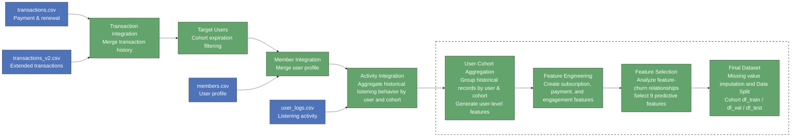
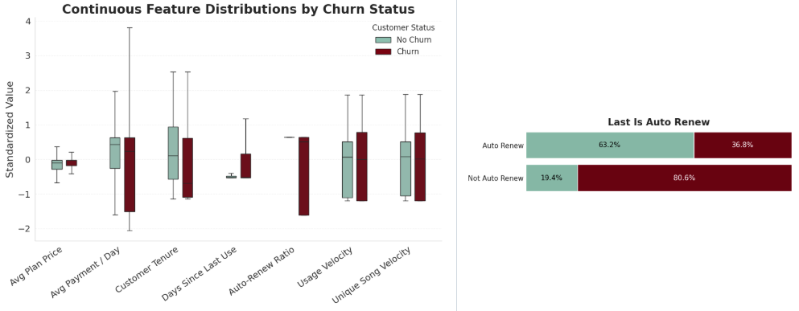
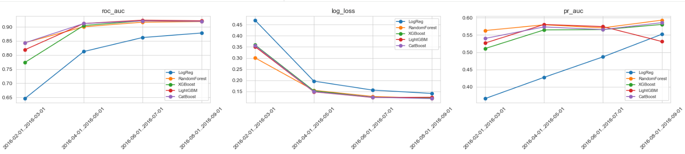
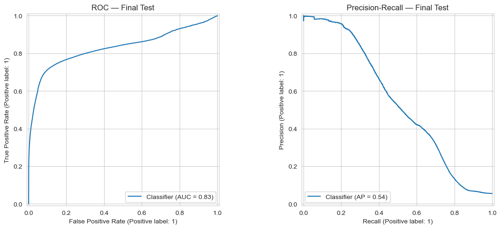
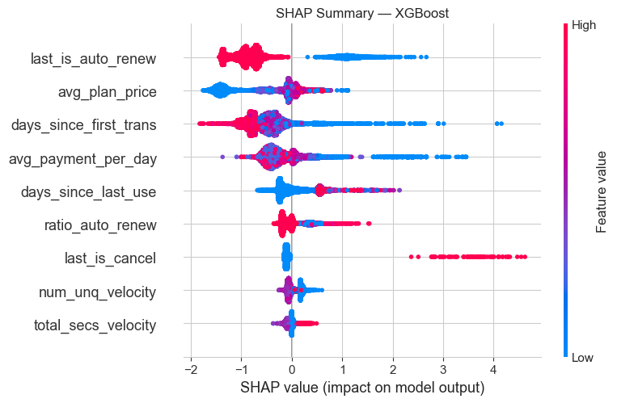

# Loyal Customers vs. Ghost Accounts
## A Machine Learning Framework for Predicting User Retention and Churn on KKbox

**Authors:** [Yingying Yang](https://github.com/your-handle) · [Darryl Jent](https://github.com/darryl-handle) · [Linxin Liu](https://github.com/linxin-handle) · [Kaiwen Jin](https://github.com/kaiwen-handle) · [Albert Lu](https://github.com/albert-handle)

📄 [Executive Summary](KKBox%20Churn%20Prediction%20Executive%20Summary.pdf)

A time-aware validation framework identifies high-risk users with XGBoost achieving strong predictive performance while maintaining model interpretability.

## Project Summary

| Component | Description |
|-----------|-------------|
| **Dataset** | ~17M user records across 25 monthly cohorts (2015.01–2017.02), with 28 engineered features |
| **Churn Definition** | Churn prediction within the future subscription window: churn = 1, non-churn = 0 |
| **Class Balance** | 7.44% churn vs. 92.56% non-churn |
| **Final Model** | XGBoost selected with PR-AUC = **0.542**, achieving **10×** improvement over random baseline (**0.055**) |


## Project Overview

Music streaming platforms acquire millions of users, yet retaining long-term subscribers remains a major challenge. This project develops a machine learning framework to predict user churn on KKBOX by leveraging subscription patterns, listening behaviors, and profile information. The analysis aims to uncover key drivers of customer retention and identify users at risk of leaving the platform.


## Data Source

| File / Source | Description |
|---|---|
| **transactions.csv** | User transaction records (~2.1M rows), including payment history, subscription plans, renewal status, and cancellation behavior. |
| **transactions_v2.csv** | Updated transaction records (~7.1M rows) containing additional subscription activities through 2017-03-31. |
| **user_logs.csv** | Daily user listening behavior logs (~104.9M rows), including song play counts, unique songs, and total listening duration. |
| **members.csv** | User demographic and account information (~3.4M users), including city, age, gender, registration method, and account dates. |


## Data Preprocessing Pipeline



## Stage Summary

| Stage | Name | Key Transformations |
|---|---|---|
| 1 | **Transaction Data Generation** | Combined `transactions.csv` and `transactions_v2.csv`; removed duplicate transaction records; removed users with more than two transactions on the same day due to ambiguous ordering; sorted transaction history and generated 25 monthly cohort datasets based on membership expiration dates and cohort cutoff dates; constructed churn labels based on future renewal behavior. |
| 2 | **User Log Data Generation** | Filtered user listening logs to cohort users before each cutoff date; performed cohort-based aggregation on large-scale activity data; generated historical engagement features including listening activity, unique song counts, and usage velocity metrics; merged cohort-level activity information into transaction cohorts. |
| 3 | **User-Cohort Dataset Construction** | Merged transaction history, user activity, and member information by `msno` and cohort date; constructed user-cohort level observations where each row represents one user in one prediction month; removed unreliable demographic variables with inconsistent temporal interpretation. |
| 4 | **Feature Engineering & Selection** | Aggregated multiple historical records within each user-cohort into predictive features, including transaction statistics, payment behavior, renewal/cancellation patterns, recency metrics, and engagement trends; evaluated feature relationships with churn outcomes; selected 9 predictive features for modeling. |
| 5 | **Dataset Preparation** | Applied time-based cohort splitting to simulate future prediction scenarios; used earlier cohorts for training and validation and reserved future cohorts for final evaluation; performed missing value imputation on selected predictors before modeling. |


## Data Preparation Summary

| Step | Operation |
|---|---|
| 1 | Remove unreliable profile features (`bd`, `registration_init_time`) and unused raw fields; retain transaction and activity variables for cohort-based prediction. |
| 2 | Aggregate multiple transaction records within each user-cohort; generate subscription features including transaction count, payment statistics, renewal ratio, cancellation history, and latest subscription status. |
| 3 | Aggregate historical listening logs by user-cohort; transform daily activity records into engagement trend features and velocity metrics to capture changes in usage patterns over time rather than only absolute activity levels. |
| 4 | Create derived recency and behavioral features, including account tenure, days since last activity, payment intensity, and auto-renew behavior. |
| 5 | Handle missing values in selected predictors; missingness mainly occurred in activity-based features (`total_secs_velocity`, `num_unq_velocity`); apply imputation before modeling. |
| 6 | Remove redundant features based on correlation analysis (e.g., highly correlated usage velocity metrics); evaluate feature-churn relationships and select 9 predictors for final modeling.


## Feature Engineering

### Feature Categories (9 total)

| Category | Features | Intuition |
|----------|:--------:|---------|
| **Transaction behavior** | 4 | `last_is_cancel`, `last_is_auto_renew`, `ratio_auto_renew`, `avg_plan_price` |
| **Tenure & timing** | 2 | `days_since_first_trans`, `avg_payment_per_day` |
| **Usage velocity** | 2 | `total_secs_velocity`, `num_unq_velocity` — recent activity vs the user's own baseline |
| **Engagement recency** | 1 | `days_since_last_use` |


### Feature Distributions vs. Churn




### Velocity, Not Volume

Absolute listening time is meaningless without context — 400 minutes is a lot for one user and nothing for another. Instead of raw volume, we measure each user against **their own recent baseline**:

| Feature | Definition |
|--------|---------|
| `total_secs_velocity` | 14-day listening time ÷ 30-day listening time |
| `num_unq_velocity` | 14-day unique tracks ÷ 30-day unique tracks |

A value well below 1 means a user is fading relative to their own norm — an early churn signal that shows up before they actually cancel.

---

## Modeling Pipeline

The modeling notebook (`5_modeling.ipynb`) runs the same protocol for every model:

| Step | Name | Purpose |
|:----:|------|---------|
| 1 | **Time-series cross-validation** | Expanding-window CV over cohorts — train on earlier cohorts, validate on the next. Used as a *stability diagnostic*, not for selection |
| 2 | **Validation scoring** | Train on the full training set, score once on the fixed validation cohorts. This is where the winner is chosen |
| 3 | **Metric: PR-AUC** | Selection on PR-AUC, not ROC-AUC — appropriate for a 5–8% churn rate |
| 4 | **Bayesian tuning** | Optuna (TPE) on the winning model, tuned on validation only (20 trials) |
| 5 | **Final evaluation** | Refit on train + val; evaluate on the test set (single touch) |
| 6 | **Explainability** | SHAP summary for the final model; per-user SHAP for the report layer |

### Validation Strategy

- **Time-ordered split**, never random: train (20 cohorts) / val (Oct–Nov 2016) / test (Dec 2016 – Feb 2017)
- Time-series CV as a robustness check on stability across time
- **Test set touched once**, for final reporting only

---

## Models Evaluated

| Model | Type | Key Properties |
|-------|------|----------------|
| Logistic Regression | Linear | L2-regularised, `StandardScaler`, median imputation — linear baseline |
| Random Forest | Ensemble (bagging) | Depth-limited trees |
| XGBoost | Gradient boosting | Histogram tree method, column/row subsampling |
| LightGBM | Gradient boosting | Histogram-based, leaf-wise growth |
| CatBoost | Gradient boosting | Ordered boosting, built-in regularisation |

> **One fair fight.** All five models use identical time-based splits, no class balancing (removed everywhere so no single model is quietly flattered), and are compared on the same metric. A comparison is only as honest as its worst-configured model.

---

## Model Selection: Validation, Not Cross-Validation

Selection and robustness answer two different questions, so we use two different tools.

**Validation picks the winner.** Each model trains on the full training set and is scored once on the fixed validation cohorts — a clean slice of the future, sitting after training in time. This mirrors real deployment: train on history, predict the next period.

**Cross-validation checks it holds.** Time-series CV rolls the cutoff forward across cohorts and asks whether a model stays stable over time, or was lucky once. It is a diagnostic, not the selection criterion — a model that wins on validation but swings wildly across CV folds is a red flag.



On validation PR-AUC, the four tree models sit within **0.0025** of each other; XGBoost edges ahead, and Logistic Regression is the only clear laggard.

| Model | Validation PR-AUC |
|-------|:-----------------:|
| **XGBoost** | **0.7588** |
| CatBoost | 0.7580 |
| Random Forest | 0.7576 |
| LightGBM | 0.7563 |
| Logistic Regression | 0.7032 |

Because the tree models are effectively tied, XGBoost is chosen for its narrow edge plus mature tuning and explanation tooling. Bayesian tuning on validation added a further +0.0012 — small, and we report it as such.

---

## A Data Leak We Found and Fixed

Missing `days_since_last_use` values were originally imputed with a sentinel computed separately within each split — train, val, and test were each imputed using their own maximum. Because the val and test sentinels were computed from data that includes information not available at prediction time, this was a leak.

The fix, in `5_modeling.ipynb`, changes only how val and test are imputed: the sentinel is now the maximum `days_since_last_use` seen in the **training data only**, and that same train-derived value is used to fill missing values in train, val, and test alike. The train split's imputed values are unchanged by this fix — train was already being imputed with its own max, which is the same value it's imputed with now. What changed is val (and test): instead of being imputed with the max computed over val itself, it's now imputed with the max computed over train.

This fix addresses the leak for the val/test split, but **we did not fix it for the CV folds** — each CV fold's val imputation still uses information beyond what that fold's training data would have available. Since CV is used only as a stability diagnostic and not for model selection, we judged the residual leak there to be low-impact, but it remains unaddressed. The fully-clean fix — per-fold imputation inside a pipeline — is noted as future work.

> Finding and fixing a leak in our own pipeline is, we think, more credible than presenting one that merely looks flawless.

---

## Final Model: XGBoost

The tuned XGBoost is refit on train + val, then evaluated once on the three held-out test cohorts (Dec 2016 – Feb 2017).



| Cohort | Churn Rate | ROC-AUC | Log Loss | PR-AUC |
|--------|:----------:|:-------:|:--------:|:------:|
| Dec 2016 | 8.06% | 0.788 | 0.204 | 0.624 |
| Jan 2017 | 4.49% | 0.879 | 0.121 | 0.475 |
| Feb 2017 | 3.94% | 0.858 | 0.119 | 0.379 |
| **Overall (pooled)** | **5.51%** | **0.830** | **0.148** | **0.542** |

**PR-AUC of 0.542 against a 5.5% base rate is a ~9.8× lift over random guessing.** PR-AUC falls month over month, but so does the churn rate — a rarer target lowers the ceiling on PR-AUC. Read as a multiple over each month's base rate, performance is far more stable than the raw score suggests.

*Why PR-AUC and not ROC-AUC:* at a 5.5% base rate, ROC-AUC flatters — a model can post an impressive number while still missing most churners. PR-AUC reflects what a retention team actually cares about: how many of the users we flag are truly about to leave.

---

## Can an Ensemble Do Better?

We also built a weighted ensemble of all five models, with weights fit on performance across the **time-series CV folds** rather than on the validation set. That freed up validation to serve as a held-out set for comparing the ensemble against XGBoost, so the numbers below are reported on the **validation data**, not test. The four tree models split the weight almost evenly; Logistic Regression earned almost none.

| Metric | Ensemble (val) | XGBoost (val) | |
|--------|:--------:|:-------:|---|
| PR-AUC | 0.5459 | 0.5420 | ensemble +0.0039 |
| Log Loss | 0.1432 | 0.1479 | ensemble better |
| ROC-AUC | 0.8296 | 0.8303 | XGBoost better |

*(Note: these figures carry over from the previous version of this table — since the evaluation split changed from test to validation, they should be double-checked against a re-run of `6_ensemble.ipynb` before this is treated as final.)*

The ensemble wins on two metrics and loses on one — too small and too mixed to call a clear improvement. More importantly, explaining an ensemble per user requires a model-agnostic method orders of magnitude slower than `TreeExplainer`. **We shipped the single XGBoost model**: the gain wasn't worth giving up per-user explainability.

---

## Explaining Predictions: SHAP → LLM

A score alone isn't actionable. The final layer (`7_LLM_churn_explanation.ipynb`) turns each prediction into a retention report in plain language.



The pipeline is deliberately fenced:

```
Trained model → per-user SHAP → structured evidence → LLM → plain-language report
```

- **SHAP decides the facts.** For a given user, SHAP produces which features moved the model's prediction and in which direction. Because SHAP is computed per user, it already reflects that user's full feature context.
- **The LLM only translates.** It receives the structured evidence — nothing else — and writes the report. It cannot invent a driver the model didn't use, and the structured evidence ships alongside every report so a human can audit the narrative against the model.
- **A limit we state, not hide.** SHAP measures the model's *attribution*, not real-world *causation*, and its additive form can't fully express conditional interactions. Reports describe what the model weighted, and hedge any business reading ("may suggest," not "because").

Reading the SHAP summary: `last_is_auto_renew` has the largest *average* impact (it applies to everyone, and passive renewal pulls risk down), while `last_is_cancel` is rare but delivers the single hardest push toward churn when it occurs — average impact and peak impact are different questions.

---


## Explaining Predictions: SHAP → LLM

A score alone isn't actionable. The final layer (`7_LLM_churn_explanation.ipynb`) turns each prediction into a retention report in plain language.


The pipeline is deliberately fenced:

```
Trained model → per-user SHAP → structured evidence → LLM → plain-language report
```

- **SHAP decides the facts.** For a given user, SHAP produces which features moved the model's prediction and in which direction. Because SHAP is computed per user, it already reflects that user's full feature context.
- **The LLM only translates.** It receives the structured evidence — nothing else — and writes the report. It cannot invent a driver the model didn't use, and the structured evidence ships alongside every report so a human can audit the narrative against the model.
- **A limit we state, not hide.** SHAP measures the model's *attribution*, not real-world *causation*, and its additive form can't fully express conditional interactions. Reports describe what the model weighted, and hedge any business reading ("may suggest," not "because").

Reading the SHAP summary: `last_is_auto_renew` has the largest *average* impact (it applies to everyone, and passive renewal pulls risk down), while `last_is_cancel` is rare but delivers the single hardest push toward churn when it occurs — average impact and peak impact are different questions.

---


