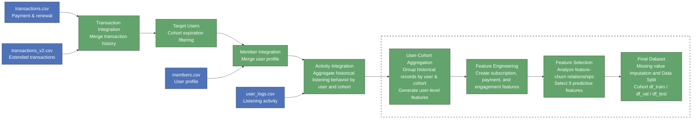

# Loyal Customers vs. Ghost Accounts
## A Machine Learning Framework for Predicting User Retention and Churn on KKbox

[Executive Summary](KKBox%20Churn%20Prediction%20Executive%20Summary.pdf)

A time-aware validation framework identifies high-risk users with XGBoost achieving strong predictive performance while maintaining model interpretability.

## Project Summary

| Component | Description |
|-----------|-------------|
| **Dataset** | ~17M user records across 25 monthly cohorts (2015.01–2017.02), with 28 engineered features |
| **Churn Definition** | Churn prediction within the future subscription window: churn = 1, non-churn = 0 |
| **Class Balance** | 7.44% churn vs. 92.56% non-churn |
| **Final Model** | XGBoost selected with PR-AUC = **0.542**, achieving **10×** improvement over random baseline (**0.055**) |

## Project Overview

Music streaming platforms acquire millions of users, yet retaining long-term subscribers remains a major challenge. This project develops a machine learning framework to predict user churn on KKBOX by leveraging subscription patterns, listening behaviors, and profile information. The analysis aims to uncover key drivers of customer retention and identify users at risk of leaving the platform.

## Data Source

| File / Source | Description |
|---|---|
| **transactions.csv** | User transaction records (~2.1M rows), including payment history, subscription plans, renewal status, and cancellation behavior. |
| **transactions_v2.csv** | Updated transaction records (~7.1M rows) containing additional subscription activities through 2017-03-31. |
| **user_logs.csv** | Daily user listening behavior logs (~104.9M rows), including song play counts, unique songs, and total listening duration. |
| **members.csv** | User demographic and account information (~3.4M users), including city, age, gender, registration method, and account dates. |

## Data Preprocessing Pipeline

## Stage Summary

| Stage | Name | Key Transformations |
|---|---|---|
| 1 | **Transaction Data Generation** | Combined `transactions.csv` and `transactions_v2.csv`; removed duplicate transaction records; removed users with more than two transactions on the same day due to ambiguous ordering; sorted transaction history and generated 25 monthly cohort datasets based on membership expiration dates and cohort cutoff dates; constructed churn labels based on future renewal behavior. |
| 2 | **User Log Data Generation** | Filtered user listening logs to cohort users before each cutoff date; performed cohort-based aggregation on large-scale activity data; generated historical engagement features including listening activity, unique song counts, and usage velocity metrics; merged cohort-level activity information into transaction cohorts. |
| 3 | **User-Cohort Dataset Construction** | Merged transaction history, user activity, and member information by `msno` and cohort date; constructed user-cohort level observations where each row represents one user in one prediction month; removed unreliable demographic variables with inconsistent temporal interpretation. |
| 4 | **Feature Engineering & Selection** | Aggregated multiple historical records within each user-cohort into predictive features, including transaction statistics, payment behavior, renewal/cancellation patterns, recency metrics, and engagement trends; evaluated feature relationships with churn outcomes; selected 9 predictive features for modeling. |
| 5 | **Dataset Preparation** | Applied time-based cohort splitting to simulate future prediction scenarios; used earlier cohorts for training and validation and reserved future cohorts for final evaluation; performed missing value imputation on selected predictors before modeling. |

## Data Preparation Summary

| Step | Operation |
|---|---|
| 1 | Removed unreliable demographic features (`bd`, `registration_init_time`) because age and registration dates were not consistent with monthly cohort prediction settings and could introduce temporal ambiguity. |
| 2 | Aggregated historical transaction records at the user-cohort level; generated subscription features including transaction count, total payment, average plan price, renewal ratio, cancellation behavior, and latest subscription status. |
| 3 | Generated user activity trend features from listening history; created velocity-based metrics to capture changes in engagement over time rather than only absolute usage levels (e.g., whether a user's listening activity is declining or remaining stable). |
| 4 | Created derived behavioral features including `ratio_auto_renew` and recency features such as `days_since_first_trans` and `days_since_last_use` to capture user loyalty and engagement decay. |
| 5 | Evaluated feature relationships with churn outcomes and removed redundant features using correlation analysis; dropped `num_100_velocity` due to high correlation with other usage velocity metrics. |
| 6 | Selected final 9 predictors for modeling: `avg_plan_price`, `avg_payment_per_day`, `days_since_first_trans`, `days_since_last_use`, `ratio_auto_renew`, `total_secs_velocity`, `num_unq_velocity`, `last_is_auto_renew`, and `last_is_cancel`. |
| 7 | Added missing-value indicators for selected activity features and applied train-based imputation; prepared final train/validation/test datasets using time-based cohort splits. |

